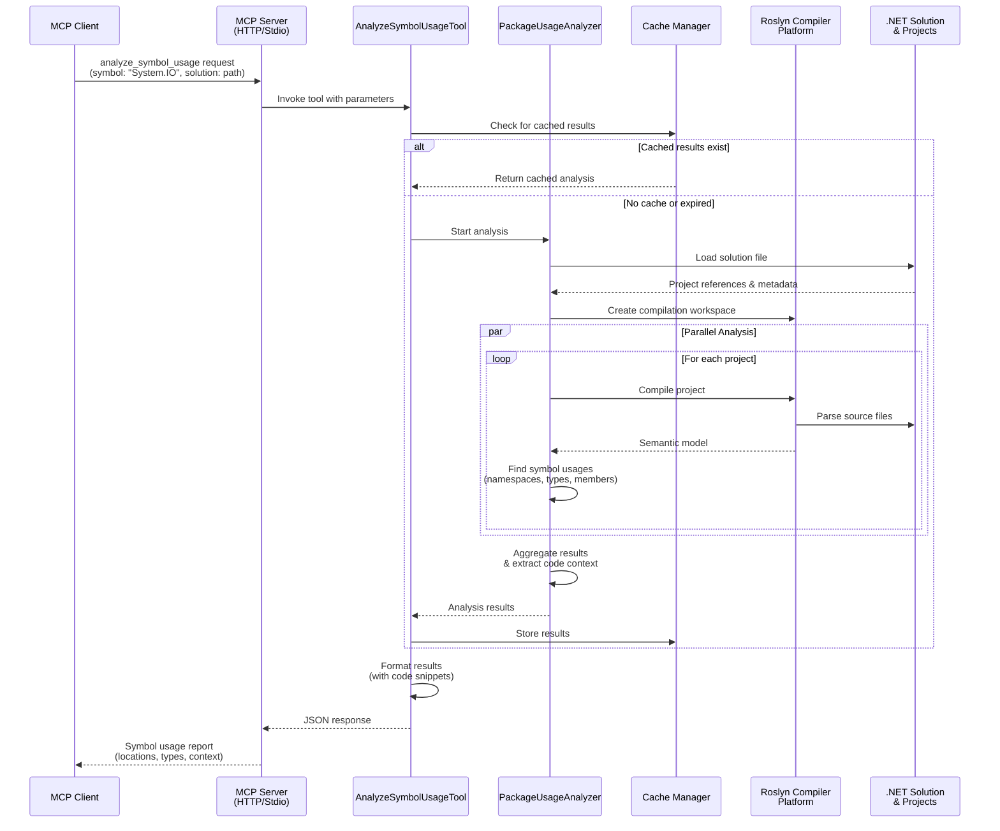

# Symbol Usage Analysis Flow

## Executive Overview
This diagram illustrates the high-level process flow when the MCP server receives a request to analyze symbol usage across a .NET codebase.



## Key Process Steps

1. **Request Initiation**: MCP client sends analyze_symbol_usage request with target symbol and solution path

2. **Cache Check**: System first checks if recent analysis results exist to optimize performance

3. **Solution Analysis**: If not cached, the system loads the .NET solution and all its projects

4. **Parallel Processing**: Multiple projects are analyzed simultaneously using Roslyn's semantic analysis

5. **Symbol Resolution**: The analyzer identifies all usages of the specified symbol (namespace, type, or member)

6. **Context Extraction**: Surrounding code context is captured for each usage to provide meaningful insights

7. **Result Aggregation**: All findings are compiled into a comprehensive report with file locations, line numbers, and usage types

## Process Flow Diagram

This flowchart provides a high-level view of the symbol analysis process, optimized for executive understanding.

```mermaid
flowchart LR
    Client[[Vulnerability<br/>Validation Agent<br/>🤖]] -.MCP Protocol.-> Server[(C# MCP Symbol<br/>Analysis Server<br/>⚙️)]
    
    Server --> Cache{Results<br/>Cache Hit?}
    
    Cache -->|Yes| FastPath>Return Cached<br/>Analysis Results]
    Cache -->|No| LoadSolution[/Load .NET<br/>Solution/]
    
    LoadSolution --> Parallel((Parallel<br/>Project Analysis))
    
    Parallel ==> Project1[Project A<br/>Analysis 📁]
    Parallel ==> Project2[Project B<br/>Analysis 📁]
    Parallel ==> Project3[Project C<br/>Analysis 📁]
    
    Project1 --> Roslyn1{{Roslyn Semantic<br/>Analysis}}
    Project2 --> Roslyn2{{Roslyn Semantic<br/>Analysis}}
    Project3 --> Roslyn3{{Roslyn Semantic<br/>Analysis}}
    
    Roslyn1 --> Walker1[/AST Traversal &<br/>Symbol Resolution/]
    Roslyn2 --> Walker2[/AST Traversal &<br/>Symbol Resolution/]
    Roslyn3 --> Walker3[/AST Traversal &<br/>Symbol Resolution/]
    
    Walker1 --> Aggregate>Aggregate<br/>All Results]
    Walker2 --> Aggregate
    Walker3 --> Aggregate
    
    Aggregate --> Context[/Extract Contextual<br/>Code Fragments/]
    
    Context --> Store[(Persistent<br/>File Cache)]
    
    Store --> Report>Comprehensive<br/>Usage Report 📊]
    FastPath --> Report
    
    Report -.|JSON-RPC 2.0|.-> Client
    
    style Client fill:#ff6b6b,stroke:#c92a2a,color:#fff
    style Server fill:#4a90e2,stroke:#2e5f8a,color:#fff
    style Cache fill:#f39c12,stroke:#c87805,color:#fff
    style FastPath fill:#27ae60,stroke:#1a7e3e,color:#fff
    style LoadSolution fill:#9b59b6,stroke:#6f3b84,color:#fff
    style Parallel fill:#e74c3c,stroke:#b93224,color:#fff
    style Project1 fill:#3498db,stroke:#2471a3,color:#fff
    style Project2 fill:#3498db,stroke:#2471a3,color:#fff
    style Project3 fill:#3498db,stroke:#2471a3,color:#fff
    style Roslyn1 fill:#16a085,stroke:#0e6655,color:#fff
    style Roslyn2 fill:#16a085,stroke:#0e6655,color:#fff
    style Roslyn3 fill:#16a085,stroke:#0e6655,color:#fff
    style Walker1 fill:#e67e22,stroke:#a85818,color:#fff
    style Walker2 fill:#e67e22,stroke:#a85818,color:#fff
    style Walker3 fill:#e67e22,stroke:#a85818,color:#fff
    style Aggregate fill:#8e44ad,stroke:#6c3483,color:#fff
    style Context fill:#f06292,stroke:#c2185b,color:#fff
    style Store fill:#2ecc71,stroke:#27ae60,color:#fff
    style Report fill:#34495e,stroke:#2c3e50,color:#fff
```

## Performance Optimizations

- **Caching**: Results are cached to avoid redundant analysis
- **Parallel Execution**: Multiple CPU cores analyze projects concurrently
- **Semantic Analysis**: Roslyn provides accurate symbol resolution beyond simple text matching

## Security Considerations

- All analysis happens locally within the server environment
- No source code is transmitted externally
- Results contain only metadata and limited code snippets